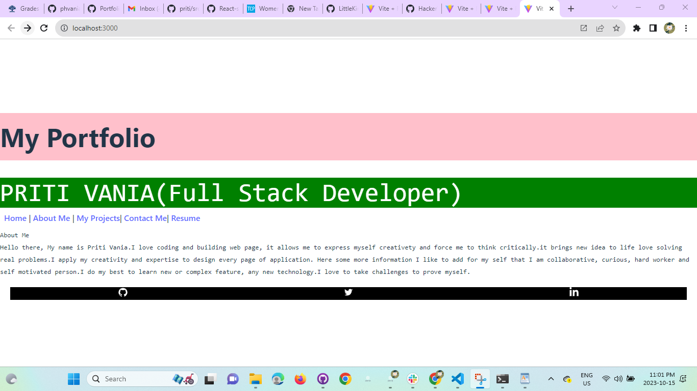

# React-Portfolio
## License:
License: MIT

## Table of contents:
Description
Installation
Usage
Contribution
Testing

## Demo:
Link: 

##  screenshot:

https://drive.google.com/file/d/1PVAeaZUXgfwxy2n55Cuz8AIZBCkdQlgm/view

## Description:
create a portfolio using your new React skills, which will help set you apart from other developers whose portfolios don’t use the latest technologies  and deploy this application to Netlify.

## Installation:
Installation: npm install
In the project directory, you can run: npm run dev
Runs the app in the development mode.
Open http://localhost:3000 to view it in the browser. The page will reload if you make edits.

## Build:
My personal portfolio  which features some of my github projects as well as my resume and technical skills.
This project was built using these technologies like React.js , Node.js , Express.js , VsCode, etc

## Usage:
Open the project folder and Navigate to /src/components/.
You will find all the components used and you can edit your information accordingly.

